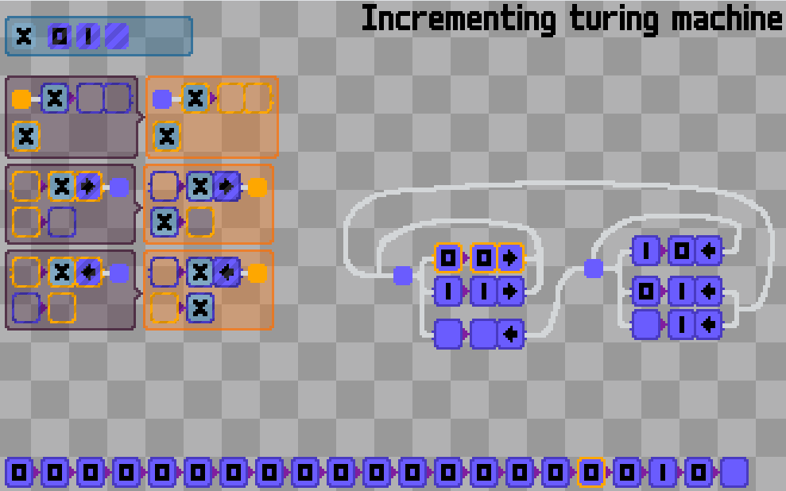
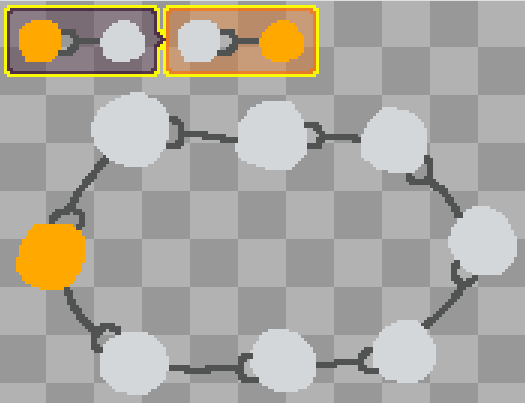

TopoLang ([try!](https://tneukom.github.io/topolang/))
========

*A Turing machine simulator implemented in Topolang
([try!](https://tneukom.github.io/topolang/index.html?demo=15_puzzle.png))*

TopoLang is an experimental programming "language" based on topological pattern
matching in images. In the example below there is a single rule, the left side
is repeatedly matched and replaced by the right side.

Topological matching means that the pattern has to be deformable into the match
without tearing.

The goal of this project is to explore what kind of program can be expressed
well with this kind of language.

*Simple chain animation
([try!](https://tneukom.github.io/topolang/index.html?demo=simple_train.png))*

## Ticks

Each tick (a set number of times per second), the rules are applied until the
world is stable, meaning any applicable has no effect. To program animations one
can use sleeping regions, which are woken up at the end of each tick.

## More features

- Solid regions, are matched exactly, no deformation allowed
- Sleeping regions are woken up at the end of a tick
- Placeholders in patterns allow more generic rules

The Turing machine simulator above uses all of these features.

## Tutorial

- [Basics](https://tneukom.github.io/topolang/index.html?demo=tutorial_basics.png)
- [Sleep](https://tneukom.github.io/topolang/index.html?demo=tutorial_sleep.png)
- [Solid](https://tneukom.github.io/topolang/index.html?demo=tutorial_solid.png)

## Some more demos

- [Boolean circuit simulator](https://tneukom.github.io/topolang/index.html?demo=4bit_adder.png)
- [Autumn tree](https://tneukom.github.io/topolang/index.html?demo=autumn_tree.png)
- [2048 Game](https://tneukom.github.io/topolang/index.html?demo=2048.png)
